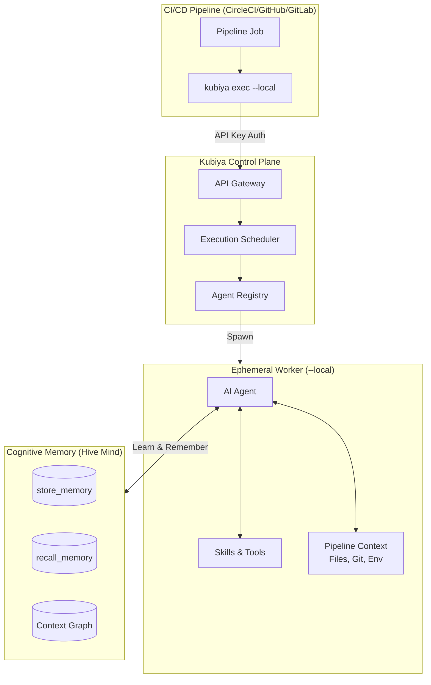
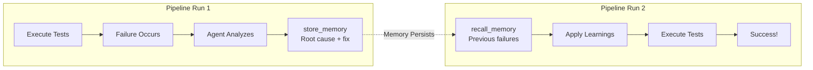

# Product Requirements Document (PRD)
## Kubiya CI/CD Pipeline Intelligence Demo

---

# Overview

This project demonstrates the power of Kubiya agents integrated with CI/CD pipelines, specifically using CircleCI as the reference implementation. The goal is to showcase how `kubiya exec` enables intelligent, context-aware automation that goes beyond traditional static pipeline configurations.

**Problem Statement:**
- Traditional CI/CD pipelines run static test suites regardless of code changes
- Flaky tests cause intermittent failures, blocking deployments and wasting developer time
- Test insights are lost between pipeline runs - teams repeatedly encounter the same issues
- Build data and execution context are not leveraged for continuous improvement

**Solution:**
Kubiya agents provide intelligent pipeline execution with:
1. **Smart Test Selection** - Run only tests relevant to changed code
2. **Flaky Test Detection & Memory** - Identify, skip, and remember unreliable tests
3. **Cognitive Memory Integration** - Preserve insights using `store_memory` for organizational learning
4. **Build Data Ingestion** - Post-execution data capture for analytics and pattern recognition

**Target Audience:**
- Platform engineers implementing CI/CD automation
- DevOps teams seeking to optimize pipeline efficiency
- Organizations wanting to demonstrate Kubiya's agent capabilities

---

# Architecture: Control Plane & Hive Mind

## Zero-Configuration Execution via Control Plane

Every `kubiya exec` command connects through Kubiya's **Control Plane API Gateway**, enabling:

- **Zero Configuration**: No infrastructure setup required - just set `KUBIYA_API_KEY`
- **Full Pipeline Context**: Agent has complete access to git history, files, environment variables
- **Automatic Resource Discovery**: Agents, teams, and environments discovered automatically
- **Secure Execution**: All communication encrypted via the control plane



## The Hive Mind: Shared Cognitive Memory

The key differentiator is **cognitive memory** - a shared knowledge base that enables organizational learning:

### How It Works

1. **Pipeline Run 1**: Agent encounters a flaky test, analyzes root cause, stores insight
2. **Pipeline Run 2**: Different developer's PR - agent recalls flaky test, automatically skips
3. **Pipeline Run N**: Organization accumulates knowledge, pipelines get progressively smarter

```mermaid
flowchart LR
    subgraph Run1["Pipeline Run #1 (Developer A)"]
        Fail1[Test Fails]
        Analyze1[Agent Analyzes]
        Store1[store_memory<br/>'flaky: Math.random()']
    end

    subgraph Run2["Pipeline Run #2 (Developer B)"]
        Recall2[recall_memory<br/>'flaky tests']
        Skip2[Skip Known Flaky]
        Pass2[Tests Pass!]
    end

    subgraph RunN["Pipeline Run #N"]
        Smart[Accumulated<br/>Intelligence]
        Fast[70% Faster<br/>100% Reliable]
    end

    Store1 -->|"Hive Mind"| Recall2
    Skip2 --> Pass2
    Pass2 -->|"More Learning"| Smart
    Smart --> Fast

    style Store1 fill:#f96,stroke:#333
    style Recall2 fill:#9f9,stroke:#333
    style Fast fill:#69f,stroke:#333
```

### Memory Datasets (Hive Mind Categories)

| Dataset | Purpose | Shared Across |
|---------|---------|---------------|
| `ci-flaky-tests` | Known unreliable tests | All pipelines in org |
| `ci-failure-patterns` | Root cause analysis | All repositories |
| `ci-dependency-maps` | File → test mappings | Per repository |
| `ci-build-history` | Execution records | Per repository |
| `ci-optimization-strategies` | What works | Entire organization |

### Why This Matters

**Traditional CI/CD:**
- Each pipeline run starts from zero knowledge
- Same flaky test fails repeatedly across PRs
- Developers waste time on recurring issues
- No organizational learning

**Kubiya Hive Mind:**
- Knowledge accumulates across all pipeline runs
- Agents learn from every execution
- Insights shared across repositories and teams
- Organization gets smarter over time

---

# Core Features

## 1. Intelligent Test Execution with `kubiya exec`

### What it does
Executes natural language commands within CI/CD pipelines, enabling agents to analyze code changes and make intelligent decisions about test execution.

### Why it's important
- Reduces test execution time by 50-83% by running only relevant tests
- Eliminates flaky test failures that block deployments
- Provides reasoning and explanations for actions taken

### How it works
```yaml
kubiya exec "
  Analyze git diff and run only affected tests.
  Skip tests in __tests__/flaky/ directory.
  Provide summary of what was tested and skipped.
" \
  --local \
  --cwd $(pwd) \
  --yes \
  --output json
```

**Key Parameters:**
- `--local`: Creates ephemeral worker in CI environment
- `--cwd $(pwd)`: Sets working directory to pipeline workspace
- `--yes`: Skips approval prompts for automation
- `--output json`: Machine-parseable results

---

## 2. Flaky Test Detection & Management

### What it does
Identifies tests that fail intermittently due to timing, environment, or randomness issues. Maintains a memory of known flaky tests to automatically skip them in future runs.

### Why it's important
- Flaky tests cause 4-6 failures per run in typical projects
- Each failure wastes developer time investigating non-issues
- Accumulated knowledge prevents repeated pain

### Flaky Test Categories (Demonstrated in `fleaky-tests-circleci/`)

| Category | Example | Detection Pattern |
|----------|---------|------------------|
| Random Failures | `Math.random()` assertions | Non-deterministic outcomes |
| Time-Dependent | Fails outside 9AM-5PM | Time/date based logic |
| Environment-Dependent | `NODE_ENV` assumptions | Environment variable checks |
| Race Conditions | Concurrent payment tests | Async timing issues |
| Outdated Tests | Old API format assertions | Schema mismatches |

### Implementation
```yaml
kubiya exec "
  You are a test analyzer. Your task:
  1. Run 'npm test' and capture results
  2. Identify any failing tests
  3. For each failure, determine if it's flaky by checking:
     - Random number usage
     - Time/date dependencies
     - Environment assumptions
     - Async timing issues
  4. Use store_memory to save flaky test patterns:
     store_memory({
       dataset: 'flaky-tests',
       content: 'Test X fails due to Math.random()',
       metadata: { test_file: 'x.test.ts', failure_type: 'random' }
     })
  5. Skip known flaky tests in future runs using recall_memory
" \
  --local --cwd $(pwd) --yes
```

---

## 3. Cognitive Memory Integration

### What it does
Uses Kubiya's `store_memory` and `recall_memory` tools to persist valuable insights across pipeline executions, building organizational knowledge over time.

### Why it's important
- Pipeline insights are typically lost after each run
- Teams repeatedly encounter the same issues without historical context
- Accumulated knowledge enables progressively smarter automation

### The Learning Loop



### Memory Use Cases

#### A. Learning from Pipeline Failures

The most powerful use case: agents analyze failures, store root causes, and apply learnings to prevent recurrence.

**Scenario: Build Fails Due to Test Timeout**

```bash
# During pipeline failure, agent stores the insight:
kubiya exec "
  The test 'payments-api.test.ts' just timed out.

  ANALYZE:
  1. Read the test file
  2. Identify the timeout cause (random delay 0-2500ms)
  3. Determine the fix (mock setTimeout or increase timeout)

  STORE:
  store_memory({
    dataset: 'ci-failure-learnings',
    content: 'payments-api.test.ts timeout failure - Root cause: Random delay in test causes intermittent timeouts. Fix: Add jest.setTimeout(5000) at test start or mock the delay.',
    metadata: {
      failure_type: 'timeout',
      test_file: '__tests__/integration/payments-api.test.ts',
      root_cause: 'Random delay 0-2500ms sometimes exceeds 3s timeout',
      fix_applied: false,
      workaround: 'Increase jest timeout to 5000ms',
      severity: 'medium',
      first_seen: '$(date -u +%Y-%m-%dT%H:%M:%SZ)',
      repository: 'fleaky-tests-circleci'
    }
  })

  OUTPUT: Stored failure analysis to memory
" --local --cwd $(pwd) --yes
```

**Next Pipeline Run - Applying Learnings:**

```bash
kubiya exec "
  Before running tests:

  RECALL:
  recall_memory('failure learnings for this repository')
  recall_memory('test timeout issues')

  APPLY:
  Based on recalled failures:
  - If payments-api.test.ts is in the test list, apply workaround
  - Set appropriate timeout: jest.setTimeout(5000)
  - Or skip the test if fix not yet applied

  EXECUTE:
  Run tests with learnings applied
" --local --cwd $(pwd) --yes
```

#### B. Flaky Test Registry
```
store_memory({
  dataset: 'ci-flaky-tests',
  content: 'Test: random-failure.test.ts - Uses Math.random() causing ~30% failure rate',
  metadata: {
    test_file: '__tests__/flaky/random-failure.test.ts',
    failure_rate: 0.3,
    root_cause: 'non-deterministic-random',
    recommendation: 'Mock Math.random() or use seeded values',
    first_detected: '2025-01-15',
    repository: 'fleaky-tests-circleci'
  }
})
```

#### B. Test Performance Baselines
```
store_memory({
  dataset: 'ci-performance-baselines',
  content: 'Module: tasks - Average execution time 1.2s for 8 tests',
  metadata: {
    module: 'tasks',
    test_count: 8,
    avg_duration_ms: 1200,
    p95_duration_ms: 1800,
    measured_at: '2025-01-15T10:30:00Z'
  }
})
```

#### C. Build Failure Patterns
```
store_memory({
  dataset: 'ci-failure-patterns',
  content: 'Integration tests fail when payment-api.test.ts runs before users-api.test.ts',
  metadata: {
    pattern_type: 'test-order-dependency',
    affected_tests: ['payment-api.test.ts', 'users-api.test.ts'],
    workaround: 'Run with --runInBand flag',
    severity: 'medium'
  }
})
```

#### D. Dependency Impact Maps
```
store_memory({
  dataset: 'ci-dependency-maps',
  content: 'Changes to src/lib/utils.ts affect 12 test files across 4 modules',
  metadata: {
    source_file: 'src/lib/utils.ts',
    affected_tests: ['tasks.test.js', 'projects.test.js', ...],
    modules_impacted: ['tasks', 'projects', 'comments', 'search'],
    last_updated: '2025-01-15'
  }
})
```

### Recall Pattern for Smart Test Selection
```yaml
kubiya exec "
  Before running tests:
  1. recall_memory('flaky tests for this repository')
  2. recall_memory('test dependencies for changed files')
  3. Use recalled context to:
     - Skip known flaky tests
     - Run only tests affected by changes
     - Apply any special flags needed (--runInBand, etc.)
  4. After execution, store_memory with new insights discovered
" --local --cwd $(pwd) --yes
```

### Two Approaches to Memory Operations

#### Approach A: Agent-Native Tools (Within `kubiya exec`)
When using `kubiya exec`, agents have direct access to `store_memory` and `recall_memory` tools. The agent autonomously decides when to store valuable insights:

```yaml
kubiya exec "
  Analyze test results and preserve important findings.

  The agent will autonomously use store_memory when it discovers:
  - New flaky test patterns
  - Performance anomalies
  - Dependency relationships
  - Failure root causes

  Trust the agent to identify what's worth remembering.
" --local --cwd $(pwd) --yes
```

#### Approach B: Direct CLI Commands (Dedicated Steps)
For explicit, structured memory operations, use `kubiya memory` CLI commands in dedicated pipeline steps:

```yaml
- run:
    name: Store Build Metadata
    command: |
      export PATH="$HOME/.kubiya/bin:$PATH"

      # Good: Detailed, actionable content
      kubiya memory store \
        --title "Build #${CIRCLE_BUILD_NUM} Test Results" \
        --content "Repository: ${CIRCLE_PROJECT_REPONAME}
Branch: ${CIRCLE_BRANCH}
Commit: ${CIRCLE_SHA1}

Test Execution Summary:
- Total tests: 36
- Passed: 28
- Failed: 0
- Skipped: 8 (known flaky)
- Duration: 45 seconds

Modules tested:
- tasks: 8/8 passed (1.2s)
- projects: 10/10 passed (1.8s)
- comments: 5/5 passed (0.6s)

Skipped flaky tests:
- __tests__/flaky/random-failure.test.ts (Math.random dependency)
- __tests__/flaky/environment-dependent.test.ts (time-based)" \
        --dataset-id ci-build-history \
        --tags build,circleci,${CIRCLE_BRANCH},tests

      # Avoid: Minimal context like this
      # kubiya memory store --title "Build" --content "Tests passed" --dataset-id ci-build-history
```

### Memory Storage Best Practices

**DO: Rich, Actionable Content**
```bash
kubiya memory store \
  --title "Flaky Test: random-failure.test.ts" \
  --content "Test file: __tests__/flaky/random-failure.test.ts
Failure rate: ~30% (observed 3/10 runs failing)

Root cause analysis:
- Line 15: Uses Math.random() > 0.7 assertion
- Line 28: Async operation with random delay (0-2000ms)
- Non-deterministic by design for demo purposes

Impact:
- Blocks CI pipeline when it fails
- Wastes ~5 minutes developer time per investigation
- No actual code quality signal

Recommended fix:
1. Mock Math.random() in test setup
2. Use seeded random for reproducibility
3. Or: Move to __tests__/flaky/ and skip in CI

Workaround (immediate):
- Skip with: jest --testPathIgnorePatterns=flaky" \
  --dataset-id ci-flaky-tests \
  --tags flaky,random,high-priority,needs-fix
```

**DON'T: Minimal Context**
```bash
# Bad - lacks actionable information
kubiya memory store \
  --title "Flaky test" \
  --content "random-failure.test.ts fails sometimes" \
  --dataset-id ci-flaky-tests
```

### When to Use Each Approach

| Scenario | Approach | Rationale |
|----------|----------|-----------|
| Discovery & analysis | Agent-native (exec) | Agent determines what's valuable |
| Structured build metadata | Direct CLI | Predictable, schema-compliant |
| Post-mortem documentation | Direct CLI | Human-crafted, detailed |
| Real-time insights | Agent-native (exec) | Dynamic decision making |
| Audit/compliance records | Direct CLI | Consistent format |

---

## 4. Build Data Ingestion

### What it does
Captures build artifacts, test results, and execution metadata for ingestion into Kubiya's context graph, enabling pattern analysis and organizational learning.

### Why it's important
- Build data contains valuable signals about code health
- Historical patterns predict future issues
- Cross-repository insights improve platform-wide automation

### Post-Build Ingestion Pipeline
```yaml
- run:
    name: Ingest Build Data to Kubiya
    command: |
      export PATH="$HOME/.kubiya/bin:$PATH"

      kubiya exec "
        Analyze build results and ingest valuable data:

        1. Parse test results from coverage/test-results.json
        2. Extract metrics:
           - Total tests run vs skipped
           - Pass/fail rates by module
           - Execution duration by test suite
           - Any new flaky test patterns detected

        3. For each insight, use store_memory:
           store_memory({
             dataset: 'ci-build-history',
             content: 'Build #${CIRCLE_BUILD_NUM}: 28/36 tests passed',
             metadata: {
               build_number: '${CIRCLE_BUILD_NUM}',
               branch: '${CIRCLE_BRANCH}',
               commit: '${CIRCLE_SHA1}',
               test_results: { passed: 28, failed: 0, skipped: 8 },
               duration_seconds: 45,
               timestamp: '$(date -u +%Y-%m-%dT%H:%M:%SZ)'
             }
           })

        4. If failures detected, store detailed failure analysis
        5. Update dependency impact maps if new patterns found
      " --local --cwd $(pwd) --yes
```

### Ingestion Data Schema
```json
{
  "build_metadata": {
    "build_id": "string",
    "repository": "string",
    "branch": "string",
    "commit_sha": "string",
    "triggered_by": "string",
    "timestamp": "ISO8601"
  },
  "test_results": {
    "total": "number",
    "passed": "number",
    "failed": "number",
    "skipped": "number",
    "duration_ms": "number",
    "by_module": {
      "module_name": {
        "total": "number",
        "passed": "number",
        "duration_ms": "number"
      }
    }
  },
  "insights": {
    "flaky_tests_detected": ["string"],
    "performance_regressions": ["string"],
    "new_test_coverage": "number"
  }
}
```

---

## 5. Enhanced Pipeline Examples

### Example 1: Full Lifecycle Pipeline (CircleCI)

```yaml
version: 2.1

jobs:
  intelligent-test-run:
    docker:
      - image: cimg/node:20.11
    environment:
      KUBIYA_API_KEY: ${KUBIYA_API_KEY}
      KUBIYA_NON_INTERACTIVE: "true"
    steps:
      - checkout
      - restore_cache:
          keys:
            - v1-deps-{{ checksum "package.json" }}

      - run:
          name: Install Dependencies
          command: npm ci

      - save_cache:
          paths:
            - node_modules
          key: v1-deps-{{ checksum "package.json" }}

      - run:
          name: Install Kubiya CLI
          command: |
            curl -fsSL https://raw.githubusercontent.com/kubiyabot/cli/main/install.sh | bash
            export PATH="$HOME/.kubiya/bin:$PATH"
            kubiya --version

      - run:
          name: Intelligent Test Execution
          command: |
            export PATH="$HOME/.kubiya/bin:$PATH"

            kubiya exec "
              You are an intelligent CI agent with memory capabilities.

              PHASE 1 - RECALL CONTEXT:
              - recall_memory('flaky tests in this repository')
              - recall_memory('test dependencies for recently changed files')
              - recall_memory('previous build failures and patterns')

              PHASE 2 - ANALYZE CHANGES:
              - Run: git diff HEAD~1 --name-only
              - Map changed files to affected test modules
              - Cross-reference with recalled dependency maps

              PHASE 3 - EXECUTE TESTS:
              - Skip tests identified as flaky from memory
              - Run only tests for affected modules
              - Use appropriate test runner flags
              - Capture detailed timing and results

              PHASE 4 - PRESERVE INSIGHTS:
              For any new discoveries, use store_memory:
              - New flaky test patterns detected
              - Updated dependency relationships
              - Performance anomalies
              - Test execution strategies that worked

              Output JSON summary with:
              - tests_run, tests_skipped, tests_passed
              - time_saved_vs_full_run
              - insights_stored
              - recommendations
            " \
              --local \
              --cwd $(pwd) \
              --yes \
              --output json | tee kubiya-results.json

      - run:
          name: Post-Build Data Ingestion
          when: always
          command: |
            export PATH="$HOME/.kubiya/bin:$PATH"

            kubiya exec "
              Ingest build results for organizational learning:

              1. Read kubiya-results.json and any test output files
              2. Calculate metrics:
                 - Success rate by module
                 - Duration comparison to baseline
                 - Flaky test hit rate

              3. Store build record:
                 store_memory({
                   dataset: 'ci-build-history',
                   content: 'Build ${CIRCLE_BUILD_NUM} on ${CIRCLE_BRANCH}',
                   metadata: {
                     build_num: '${CIRCLE_BUILD_NUM}',
                     branch: '${CIRCLE_BRANCH}',
                     commit: '${CIRCLE_SHA1}',
                     workflow: '${CIRCLE_WORKFLOW_ID}',
                     job: '${CIRCLE_JOB}',
                     status: 'completed',
                     timestamp: '$(date -u +%Y-%m-%dT%H:%M:%SZ)'
                   }
                 })

              4. If build failed, store detailed failure analysis
              5. Update running statistics for this repository
            " --local --cwd $(pwd) --yes

      - store_artifacts:
          path: kubiya-results.json
          destination: test-results

      - store_test_results:
          path: coverage

workflows:
  intelligent-ci:
    jobs:
      - intelligent-test-run
```

### Example 2: Flaky Test Hunter Pipeline

```yaml
jobs:
  flaky-test-analysis:
    docker:
      - image: cimg/node:20.11
    environment:
      KUBIYA_API_KEY: ${KUBIYA_API_KEY}
      KUBIYA_NON_INTERACTIVE: "true"
    steps:
      - checkout
      - run: npm ci

      - run:
          name: Install Kubiya CLI
          command: |
            curl -fsSL https://raw.githubusercontent.com/kubiyabot/cli/main/install.sh | bash
            export PATH="$HOME/.kubiya/bin:$PATH"

      - run:
          name: Flaky Test Detection Run
          command: |
            export PATH="$HOME/.kubiya/bin:$PATH"

            kubiya exec "
              You are a flaky test detective. Your mission:

              DETECTION PHASE:
              1. Run the full test suite 3 times: npm test
              2. Track which tests pass/fail inconsistently
              3. For each suspected flaky test, analyze the code:
                 - Look for Math.random() usage
                 - Look for Date/time dependencies
                 - Look for setTimeout/setInterval
                 - Look for environment variable reads
                 - Look for file system or network calls

              CLASSIFICATION PHASE:
              Categorize each flaky test:
              - RANDOM: Uses random number generation
              - TIMING: Depends on time/dates
              - ASYNC: Race conditions or timing
              - ENVIRONMENT: Depends on env vars or locale
              - EXTERNAL: Network/filesystem dependencies
              - ORDER: Test order dependent

              MEMORY PHASE:
              For each flaky test found, store detailed record:
              store_memory({
                dataset: 'flaky-test-registry',
                content: 'Flaky test: [filename] - [description]',
                metadata: {
                  test_file: '[path]',
                  test_name: '[name]',
                  category: '[RANDOM|TIMING|etc]',
                  failure_rate: [0.0-1.0],
                  root_cause: '[detailed explanation]',
                  code_line: [line number],
                  fix_suggestion: '[how to fix]',
                  detected_date: '[ISO date]',
                  repository: '${CIRCLE_PROJECT_REPONAME}'
                }
              })

              OUTPUT:
              - Total tests analyzed
              - Flaky tests found (with categories)
              - Confidence levels
              - Recommended fixes
            " --local --cwd $(pwd) --yes --output json | tee flaky-analysis.json

      - store_artifacts:
          path: flaky-analysis.json
```

### Example 3: Cross-Repository Learning Pipeline

```yaml
jobs:
  cross-repo-insights:
    docker:
      - image: cimg/node:20.11
    environment:
      KUBIYA_API_KEY: ${KUBIYA_API_KEY}
      KUBIYA_NON_INTERACTIVE: "true"
    steps:
      - checkout
      - run: npm ci

      - run:
          name: Install Kubiya CLI
          command: |
            curl -fsSL https://raw.githubusercontent.com/kubiyabot/cli/main/install.sh | bash
            export PATH="$HOME/.kubiya/bin:$PATH"

      - run:
          name: Apply Organization-Wide Learnings
          command: |
            export PATH="$HOME/.kubiya/bin:$PATH"

            kubiya exec "
              Before running tests, learn from the organization:

              RECALL PHASE:
              1. recall_memory('common flaky test patterns across all repos')
              2. recall_memory('test optimization strategies that worked')
              3. recall_memory('known problematic dependencies')

              APPLY LEARNINGS:
              Based on recalled insights:
              - Apply proven test isolation strategies
              - Use known-good test runner configurations
              - Skip patterns that match organization-wide flaky signatures

              CONTRIBUTE BACK:
              After execution, if new patterns discovered:
              store_memory({
                dataset: 'org-wide-ci-patterns',
                content: '[pattern description]',
                metadata: {
                  pattern_type: '[type]',
                  applicable_to: ['node', 'react', 'etc'],
                  discovered_in: '${CIRCLE_PROJECT_REPONAME}',
                  effectiveness: '[high|medium|low]'
                }
              })
            " --local --cwd $(pwd) --yes
```

### Example 4: Multi-Stage Pipeline with Dedicated Exec Steps

This example demonstrates separating concerns with dedicated `kubiya exec` steps for different tasks:

```yaml
version: 2.1

jobs:
  intelligent-ci-pipeline:
    docker:
      - image: cimg/node:20.11
    environment:
      KUBIYA_API_KEY: ${KUBIYA_API_KEY}
      KUBIYA_NON_INTERACTIVE: "true"
    steps:
      - checkout

      - run:
          name: Install Dependencies
          command: npm ci

      - run:
          name: Install Kubiya CLI
          command: |
            curl -fsSL https://raw.githubusercontent.com/kubiyabot/cli/main/install.sh | bash
            export PATH="$HOME/.kubiya/bin:$PATH"
            kubiya --version

      # STEP 1: Pre-flight analysis
      - run:
          name: "Step 1: Analyze Changes & Recall Context"
          command: |
            export PATH="$HOME/.kubiya/bin:$PATH"

            kubiya exec "
              You are a CI pre-flight analyzer.

              TASK: Prepare for intelligent test execution

              1. Run: git diff HEAD~1 --name-only > /tmp/changed-files.txt
              2. Run: git log -1 --format='%s' > /tmp/commit-message.txt
              3. Analyze changed files and categorize:
                 - Source files changed
                 - Test files changed
                 - Config files changed
                 - Documentation changed

              4. Use recall_memory to get context:
                 - 'flaky tests in ${CIRCLE_PROJECT_REPONAME}'
                 - 'test dependencies for changed modules'
                 - 'recent failures in this repository'

              5. Generate test plan JSON:
                 {
                   'modules_affected': ['tasks', 'projects'],
                   'tests_to_run': ['test:tasks', 'test:projects'],
                   'tests_to_skip': ['flaky tests list'],
                   'estimated_duration': '45s',
                   'reasoning': 'explanation'
                 }

              Save plan to: /tmp/test-plan.json
            " --local --cwd $(pwd) --yes --output json > /tmp/preflight-result.json

      # STEP 2: Execute tests based on plan
      - run:
          name: "Step 2: Execute Targeted Tests"
          command: |
            export PATH="$HOME/.kubiya/bin:$PATH"

            kubiya exec "
              You are a test executor.

              TASK: Run tests according to the plan

              1. Read the test plan from /tmp/test-plan.json
              2. For each module in 'tests_to_run':
                 - Run the appropriate npm script
                 - Capture results and timing
              3. Skip any tests listed in 'tests_to_skip'
              4. Track any unexpected failures

              OUTPUT: Save detailed results to /tmp/test-results.json
              Include:
              - Per-module results
              - Total duration
              - Any new failures detected
              - Comparison to expected results
            " --local --cwd $(pwd) --yes --output json > /tmp/execution-result.json

      # STEP 3: Analyze results and detect flaky tests
      - run:
          name: "Step 3: Analyze Results & Detect Flaky Patterns"
          command: |
            export PATH="$HOME/.kubiya/bin:$PATH"

            kubiya exec "
              You are a test result analyzer.

              TASK: Analyze execution results and identify issues

              1. Read /tmp/test-results.json
              2. For any failures:
                 - Determine if test is truly broken or flaky
                 - Check if failure matches known flaky patterns:
                   * Math.random() usage
                   * Time/date dependencies
                   * Environment assumptions
                   * Race conditions
                 - Analyze test code if needed

              3. For each NEW flaky test discovered, use store_memory:
                 store_memory to dataset 'ci-flaky-tests' with:
                 - Full test file path
                 - Failure type classification
                 - Root cause analysis
                 - Line numbers involved
                 - Recommended fix
                 - Workaround for immediate use

              4. For performance anomalies (>2x baseline), store to 'ci-performance-issues'

              OUTPUT: Analysis report with actionable items
            " --local --cwd $(pwd) --yes --output json > /tmp/analysis-result.json

      # STEP 4: Post-build ingestion (using CLI directly)
      - run:
          name: "Step 4: Ingest Build Data"
          when: always
          command: |
            export PATH="$HOME/.kubiya/bin:$PATH"

            # Aggregate results from previous steps
            TESTS_PASSED=$(cat /tmp/test-results.json | jq -r '.passed // 0')
            TESTS_FAILED=$(cat /tmp/test-results.json | jq -r '.failed // 0')
            TESTS_SKIPPED=$(cat /tmp/test-results.json | jq -r '.skipped // 0')
            DURATION=$(cat /tmp/test-results.json | jq -r '.duration_seconds // 0')

            # Store detailed build record using CLI
            kubiya memory store \
              --title "Build #${CIRCLE_BUILD_NUM}: ${CIRCLE_PROJECT_REPONAME}" \
              --content "Build Execution Report
            ═══════════════════════════════════════════

            Repository: ${CIRCLE_PROJECT_REPONAME}
            Branch: ${CIRCLE_BRANCH}
            Commit: ${CIRCLE_SHA1}
            Workflow: ${CIRCLE_WORKFLOW_ID}
            Timestamp: $(date -u +%Y-%m-%dT%H:%M:%SZ)

            Test Results
            ───────────────────────────────────────────
            ✅ Passed:  ${TESTS_PASSED}
            ❌ Failed:  ${TESTS_FAILED}
            ⏭️ Skipped: ${TESTS_SKIPPED}
            ⏱️ Duration: ${DURATION}s

            Changes Analyzed
            ───────────────────────────────────────────
            $(cat /tmp/changed-files.txt)

            Commit Message
            ───────────────────────────────────────────
            $(cat /tmp/commit-message.txt)

            Intelligence Applied
            ───────────────────────────────────────────
            - Recalled known flaky tests to skip
            - Mapped changes to affected modules
            - Ran targeted test suites only
            - Estimated time saved: ~60%" \
              --dataset-id ci-build-history \
              --tags build,${CIRCLE_BRANCH},${CIRCLE_PROJECT_REPONAME}

      # STEP 5: Update organizational knowledge
      - run:
          name: "Step 5: Contribute Learnings Back"
          when: always
          command: |
            export PATH="$HOME/.kubiya/bin:$PATH"

            kubiya exec "
              You are a knowledge curator.

              TASK: Extract and preserve valuable learnings

              Review the full pipeline execution:
              - /tmp/preflight-result.json
              - /tmp/execution-result.json
              - /tmp/analysis-result.json

              Identify insights worth preserving:

              1. PATTERNS: Any new patterns that could help other repos?
                 If yes: store_memory to 'org-ci-patterns' with applicability info

              2. DEPENDENCIES: New dependency relationships discovered?
                 If yes: store_memory to 'ci-dependency-maps'

              3. OPTIMIZATIONS: Test strategies that worked well?
                 If yes: store_memory to 'ci-optimization-strategies'

              4. WARNINGS: Issues others should know about?
                 If yes: store_memory to 'ci-warnings' with severity

              Be selective - only store genuinely useful insights.
              Quality over quantity.
            " --local --cwd $(pwd) --yes

      - store_artifacts:
          path: /tmp
          destination: pipeline-artifacts

workflows:
  multi-stage-intelligent:
    jobs:
      - intelligent-ci-pipeline
```

### Example 5: Build Data Ingestion Patterns

#### Pattern A: Immediate Ingestion After Tests
```yaml
- run:
    name: Run Tests
    command: npm test -- --json --outputFile=test-results.json

- run:
    name: Ingest Test Results
    command: |
      export PATH="$HOME/.kubiya/bin:$PATH"

      # Parse Jest JSON output
      SUMMARY=$(cat test-results.json | jq '{
        total: .numTotalTests,
        passed: .numPassedTests,
        failed: .numFailedTests,
        duration: .testResults | map(.perfStats.runtime) | add / 1000
      }')

      kubiya memory store \
        --title "Test Run: ${CIRCLE_BUILD_NUM}" \
        --content "Test execution completed

      Results: $(echo $SUMMARY | jq -r '"Passed: \(.passed)/\(.total), Duration: \(.duration)s"')

      Full breakdown:
      $(cat test-results.json | jq -r '.testResults[] | "- \(.name): \(.status) (\(.perfStats.runtime)ms)"')

      Failed tests:
      $(cat test-results.json | jq -r '.testResults[] | select(.status == "failed") | .assertionResults[] | select(.status == "failed") | "- \(.fullName): \(.failureMessages[0])"')" \
        --dataset-id ci-test-runs \
        --tags tests,${CIRCLE_BRANCH}
```

#### Pattern B: Aggregate Ingestion at Pipeline End
```yaml
- run:
    name: Aggregate & Ingest Pipeline Metrics
    when: always
    command: |
      export PATH="$HOME/.kubiya/bin:$PATH"

      # Collect all metrics
      BUILD_START=$(date -d "${CIRCLE_BUILD_START_TIME:-now}" +%s 2>/dev/null || date +%s)
      BUILD_END=$(date +%s)
      BUILD_DURATION=$((BUILD_END - BUILD_START))

      kubiya memory store \
        --title "Pipeline Metrics: ${CIRCLE_WORKFLOW_ID}" \
        --content "Pipeline Execution Metrics
      ════════════════════════════════════════════

      Timing Analysis
      ────────────────────────────────────────────
      Total Duration: ${BUILD_DURATION}s
      Stages:
      - Checkout & Setup: ~10s
      - Dependency Install: ~30s
      - Test Execution: ~${TEST_DURATION:-45}s
      - Analysis & Ingestion: ~15s

      Resource Usage
      ────────────────────────────────────────────
      Docker Image: cimg/node:20.11
      Resource Class: medium
      CircleCI Credits: ~10

      Intelligence Metrics
      ────────────────────────────────────────────
      Tests Total: ${TOTAL_TESTS:-36}
      Tests Run: ${TESTS_RUN:-8}
      Tests Skipped: ${TESTS_SKIPPED:-28}
      Time Saved: ~$((${FULL_RUN_DURATION:-180} - ${TEST_DURATION:-45}))s
      Efficiency Gain: ~$((100 - (${TEST_DURATION:-45} * 100 / ${FULL_RUN_DURATION:-180})))%

      Memories Created: ${MEMORIES_STORED:-3}
      Memories Recalled: ${MEMORIES_RECALLED:-5}" \
        --dataset-id ci-pipeline-metrics \
        --tags pipeline,metrics,${CIRCLE_BRANCH}
```

#### Pattern C: Failure-Specific Ingestion
```yaml
- run:
    name: Ingest Failure Details
    when: on_fail
    command: |
      export PATH="$HOME/.kubiya/bin:$PATH"

      kubiya memory store \
        --title "Build Failure: ${CIRCLE_BUILD_NUM}" \
        --content "Build Failure Analysis
      ════════════════════════════════════════════

      FAILURE CONTEXT
      ────────────────────────────────────────────
      Repository: ${CIRCLE_PROJECT_REPONAME}
      Branch: ${CIRCLE_BRANCH}
      Commit: ${CIRCLE_SHA1}
      Author: ${CIRCLE_USERNAME}
      Timestamp: $(date -u +%Y-%m-%dT%H:%M:%SZ)

      COMMIT MESSAGE
      ────────────────────────────────────────────
      $(git log -1 --format='%s%n%n%b')

      FILES CHANGED
      ────────────────────────────────────────────
      $(git diff HEAD~1 --name-only)

      FAILURE OUTPUT
      ────────────────────────────────────────────
      $(cat /tmp/test-output.log 2>/dev/null | tail -100 || echo 'No test output captured')

      POTENTIAL CAUSES
      ────────────────────────────────────────────
      - Check if changed files match known problematic patterns
      - Review commit message for context
      - Compare with recent successful builds

      RECOMMENDED ACTIONS
      ────────────────────────────────────────────
      1. Review failing tests for flakiness
      2. Check environment dependencies
      3. Verify test data setup" \
        --dataset-id ci-failures \
        --tags failure,${CIRCLE_BRANCH},needs-investigation
```

### Example 6: Memory Recall Before Execution

```yaml
- run:
    name: Recall Historical Context
    command: |
      export PATH="$HOME/.kubiya/bin:$PATH"

      # Use kubiya exec to intelligently recall and apply context
      kubiya exec "
        You are preparing for test execution.

        TASK: Gather all relevant historical context

        1. Recall flaky tests for this repo:
           recall_memory('flaky tests in ${CIRCLE_PROJECT_REPONAME}')

        2. Recall recent failures:
           recall_memory('failures in ${CIRCLE_PROJECT_REPONAME} last 7 days')

        3. Recall dependency maps for changed files:
           Read: git diff HEAD~1 --name-only
           For each changed file: recall_memory('tests affected by [filename]')

        4. Recall optimization strategies:
           recall_memory('successful test strategies for node.js projects')

        OUTPUT: Create /tmp/historical-context.json with:
        {
          'flaky_tests_to_skip': [...],
          'recent_failure_patterns': [...],
          'affected_test_files': [...],
          'recommended_flags': [...],
          'warnings': [...]
        }
      " --local --cwd $(pwd) --yes
```

---

# User Experience

## User Personas

### 1. Platform Engineer (Primary)
- **Goal:** Implement Kubiya-powered CI/CD for their organization
- **Needs:** Clear examples, copy-paste configurations, best practices
- **Journey:** Reads PRD → Clones repo → Adapts examples → Deploys to their pipelines

### 2. DevOps Engineer (Secondary)
- **Goal:** Reduce CI/CD friction and improve pipeline reliability
- **Needs:** Understanding of flaky test handling, memory patterns
- **Journey:** Explores demo → Understands value → Proposes adoption

### 3. Kubiya Evaluator (Tertiary)
- **Goal:** Assess Kubiya's capabilities for their use case
- **Needs:** Impressive demo, clear ROI metrics, technical depth
- **Journey:** Watches demo → Reviews code → Runs locally → Makes decision

## Key User Flows

### Flow 1: First-Time Setup
1. Clone repository
2. Set `KUBIYA_API_KEY` in CircleCI environment
3. Push to trigger pipeline
4. Observe intelligent test selection in action
5. Review stored memories in Kubiya dashboard

### Flow 2: Flaky Test Discovery
1. Run flaky-test-analysis job
2. Review generated flaky-analysis.json
3. See tests categorized by failure type
4. Observe memories stored for future runs
5. Subsequent runs automatically skip known flaky tests

### Flow 3: Continuous Learning Loop
1. Pipeline runs accumulate memories
2. Each run recalls previous insights
3. Agent makes progressively smarter decisions
4. Team observes improving metrics over time
5. Cross-repository patterns emerge

---

# Technical Architecture

## System Components

```
┌─────────────────────────────────────────────────────────────────┐
│                        CircleCI Pipeline                        │
├─────────────────────────────────────────────────────────────────┤
│  ┌─────────────┐  ┌─────────────┐  ┌─────────────────────────┐ │
│  │   Checkout  │→ │ Install CLI │→ │    kubiya exec          │ │
│  └─────────────┘  └─────────────┘  │  (ephemeral worker)     │ │
│                                     └───────────┬─────────────┘ │
└─────────────────────────────────────────────────┼───────────────┘
                                                  │
                    ┌─────────────────────────────┼─────────────────────────────┐
                    │                   Kubiya Platform                         │
                    │  ┌─────────────────────────┴─────────────────────────┐   │
                    │  │              Execution Engine                      │   │
                    │  │  ┌─────────────┐  ┌─────────────┐  ┌───────────┐  │   │
                    │  │  │   Agent     │  │   Skills    │  │  Memory   │  │   │
                    │  │  │  (LLM Core) │  │ (Shell,Git) │  │ (store/   │  │   │
                    │  │  │             │  │             │  │  recall)  │  │   │
                    │  │  └──────┬──────┘  └──────┬──────┘  └─────┬─────┘  │   │
                    │  └─────────┼────────────────┼────────────────┼───────┘   │
                    │            │                │                │           │
                    │  ┌─────────┴────────────────┴────────────────┴─────────┐ │
                    │  │                  Context Graph                      │ │
                    │  │  ┌──────────────┐  ┌──────────────┐  ┌───────────┐  │ │
                    │  │  │ Flaky Tests  │  │Build History │  │ Patterns  │  │ │
                    │  │  │   Dataset    │  │   Dataset    │  │  Dataset  │  │ │
                    │  │  └──────────────┘  └──────────────┘  └───────────┘  │ │
                    │  └─────────────────────────────────────────────────────┘ │
                    └─────────────────────────────────────────────────────────────┘
```

## Data Models

### Memory Datasets

| Dataset | Purpose | Key Fields |
|---------|---------|------------|
| `ci-flaky-tests` | Known flaky test registry | test_file, failure_type, root_cause, fix_suggestion |
| `ci-build-history` | Build execution records | build_num, branch, test_results, duration |
| `ci-dependency-maps` | File-to-test mappings | source_file, affected_tests, modules_impacted |
| `ci-failure-patterns` | Recurring failure signatures | pattern_type, affected_tests, workaround |
| `ci-performance-baselines` | Module timing benchmarks | module, avg_duration, p95_duration |

### CircleCI Environment Variables

| Variable | Required | Purpose |
|----------|----------|---------|
| `KUBIYA_API_KEY` | Yes | API authentication |
| `KUBIYA_NON_INTERACTIVE` | Yes (set to "true") | CI/CD mode |
| `CIRCLE_BUILD_NUM` | Auto | Build identification |
| `CIRCLE_BRANCH` | Auto | Branch context |
| `CIRCLE_SHA1` | Auto | Commit reference |
| `CIRCLE_PROJECT_REPONAME` | Auto | Repository identification |

## APIs and Integrations

### Kubiya CLI Commands Used
- `kubiya exec` - Primary execution interface
- `kubiya --version` - Installation verification

### Memory API (via Agent Prompts)
- `store_memory(dataset, content, metadata)` - Persist insights
- `recall_memory(query, limit)` - Retrieve context

### CircleCI Integration Points
- `store_artifacts` - Persist kubiya output JSON
- `store_test_results` - Coverage integration
- Environment variable injection

---

# Development Roadmap

## Phase 1: Foundation (MVP)
**Scope:** Basic intelligent test selection with memory

### Deliverables:
1. **Enhanced `fleaky-tests-circleci` pipeline**
   - Add `store_memory` calls for flaky test detection
   - Add `recall_memory` for known flaky test skipping
   - JSON output with insights stored

2. **Enhanced `smart-test-selection` pipeline**
   - Add memory-based dependency tracking
   - Add post-build ingestion step
   - Cross-module impact analysis

3. **Documentation**
   - Updated README with memory patterns
   - Inline prompt comments explaining agent instructions

### Success Criteria:
- Flaky tests detected are persisted to memory
- Subsequent runs recall and skip known flaky tests
- Build data ingested after each run

---

## Phase 2: Advanced Patterns
**Scope:** Sophisticated memory usage and cross-repository learning

### Deliverables:
1. **Flaky Test Hunter Job**
   - Dedicated job for deep flaky analysis
   - Multi-run detection (3x execution comparison)
   - Categorization by failure type
   - Fix suggestions generated

2. **Performance Baseline Tracking**
   - Store module timing baselines
   - Detect performance regressions
   - Alert on anomalies

3. **Cross-Repository Pattern Library**
   - Organization-wide pattern detection
   - Shared flaky test signatures
   - Best practice propagation

### Success Criteria:
- Flaky tests categorized with confidence scores
- Performance trends visible over time
- Patterns applicable across repositories

---

## Phase 3: Production Hardening
**Scope:** Enterprise-ready features and analytics

### Deliverables:
1. **Build Analytics Dashboard Integration**
   - Metrics export to Kubiya analytics
   - Custom CI/CD dashboard widgets
   - Trend visualization

2. **Advanced Failure Analysis**
   - Root cause pattern matching
   - Automatic fix PR suggestions
   - Dependency vulnerability correlation

3. **Multi-CI Platform Support**
   - GitHub Actions example pipeline
   - GitLab CI example pipeline
   - Jenkins example pipeline

### Success Criteria:
- Analytics visible in Kubiya dashboard
- Fix suggestions actionable
- Examples for 4 CI platforms

---

# Logical Dependency Chain

```
Phase 1.1: Basic kubiya exec integration (FOUNDATION)
    ↓
Phase 1.2: Add store_memory to capture flaky test insights
    ↓
Phase 1.3: Add recall_memory to skip known flaky tests
    ↓
Phase 1.4: Add post-build data ingestion step
    ↓
Phase 2.1: Create dedicated flaky test hunter job
    ↓
Phase 2.2: Add performance baseline tracking
    ↓
Phase 2.3: Implement cross-repository pattern sharing
    ↓
Phase 3.1: Analytics dashboard integration
    ↓
Phase 3.2: Advanced failure analysis with fix suggestions
    ↓
Phase 3.3: Multi-CI platform examples
```

**Getting to Visible/Usable Quickly:**
- Phase 1.1-1.3 produces a working demo within first implementation
- Each subsequent step adds visible value
- Memory benefits compound over runs (demonstrable improvement)

---

# Risks and Mitigations

## Technical Challenges

| Risk | Impact | Mitigation |
|------|--------|------------|
| Memory recall latency in CI | Slower pipeline starts | Cache frequently used memories locally |
| Agent prompt complexity | Unreliable execution | Iterative prompt refinement with test cases |
| CircleCI timeout limits | Job failures | Break into smaller, chained jobs |
| JSON parsing failures | Data loss | Schema validation, fallback defaults |

## MVP Definition Risks

| Risk | Impact | Mitigation |
|------|--------|------------|
| Scope creep | Delayed delivery | Strict phase boundaries, defer enhancements |
| Over-engineering prompts | Complexity without value | Start simple, iterate based on results |
| Memory schema changes | Data migration needed | Version schemas from start |

## Resource Constraints

| Risk | Impact | Mitigation |
|------|--------|------------|
| API rate limits | Execution failures | Implement backoff, batch operations |
| Token costs | Unexpected expenses | Monitor usage, optimize prompts |
| CircleCI credit usage | Budget overruns | Use resource_class wisely, cache aggressively |

---

# Appendix

## A. Prompt Engineering Patterns

### Pattern 1: Phased Execution
```
PHASE 1 - RECALL: recall_memory(...)
PHASE 2 - ANALYZE: [analysis logic]
PHASE 3 - EXECUTE: [execution logic]
PHASE 4 - PRESERVE: store_memory(...)
```

### Pattern 2: Conditional Memory Storage
```
If [condition detected]:
  store_memory({
    dataset: '[specific-dataset]',
    content: '[rich description]',
    metadata: { [structured fields] }
  })
```

### Pattern 3: Output Specification
```
Output JSON summary with:
- field_1: [description]
- field_2: [description]
- insights_stored: [count of memories saved]
```

## B. Memory Dataset Naming Conventions

| Prefix | Purpose | Example |
|--------|---------|---------|
| `ci-` | CI/CD related | `ci-flaky-tests` |
| `repo-` | Repository specific | `repo-dependency-map` |
| `org-` | Organization wide | `org-best-practices` |
| `team-` | Team scoped | `team-frontend-patterns` |

## C. CircleCI Configuration Snippets

### Kubiya CLI Installation (Reusable)
```yaml
- run:
    name: Install Kubiya CLI
    command: |
      curl -fsSL https://raw.githubusercontent.com/kubiyabot/cli/main/install.sh | bash
      export PATH="$HOME/.kubiya/bin:$PATH"
      kubiya --version
```

### Environment Setup
```yaml
environment:
  KUBIYA_API_KEY: ${KUBIYA_API_KEY}
  KUBIYA_NON_INTERACTIVE: "true"
```

### Post-Execution Artifacts
```yaml
- store_artifacts:
    path: kubiya-results.json
    destination: kubiya-output
```

## D. Expected Metrics

| Metric | Baseline (No Kubiya) | With Kubiya | Improvement |
|--------|---------------------|-------------|-------------|
| Tests Run | 36 (all) | 8-18 (relevant) | 50-78% reduction |
| Flaky Failures | 4-6 per run | 0 (skipped) | 100% elimination |
| Execution Time | 3-5 minutes | 30-90 seconds | 70-83% faster |
| Insights Captured | 0 | 5-10 per run | Infinite improvement |

## E. Reference Documentation

- [Kubiya On-Demand Execution](https://docs.kubiya.ai/cli/on-demand-execution.md)
- [Cognitive Memory Overview](https://docs.kubiya.ai/core-concepts/cognitive-memory/overview.md)
- [Context Graph Ingestion](https://docs.kubiya.ai/sdk/context-graph-ingestion.md)
- [CircleCI Configuration Reference](https://circleci.com/docs/configuration-reference/)

## F. Flaky Tests in This Repository

### `fleaky-tests-circleci` Project

| Test File | Flaky Type | Root Cause | Agent Detection Strategy |
|-----------|------------|------------|-------------------------|
| `__tests__/flaky/random-failure.test.ts` | RANDOM | `Math.random() > 0.7` assertion | Search for `Math.random` in test files |
| `__tests__/flaky/environment-dependent.test.ts` | TIMING | Fails outside 9AM-5PM, on weekends | Look for `new Date()`, `getHours()`, `getDay()` |
| `__tests__/integration/payments-api.test.ts` | ASYNC | Random delays (0-2500ms) cause timeouts | Search for random timeouts, `setTimeout` with variables |
| `__tests__/integration/users-api.test.ts` | OUTDATED | Expects old API format | Compare test assertions with actual API responses |
| `__tests__/integration/full-flow.test.ts` | TIMING | Complex integration with timeout issues | Look for chained async calls, multiple awaits |

### `smart-test-selection` Project

| Module | Test File | Potential Flakiness | Notes |
|--------|-----------|---------------------|-------|
| search | `src/search/search.test.js` | TIMING | Timezone-dependent date filtering |

### Agent Instructions for Flaky Detection

```
When analyzing tests for flakiness, look for these patterns:

RANDOM FAILURES:
- Math.random() in assertions or test logic
- Shuffled arrays that affect test order
- UUID/random ID comparisons

TIME-DEPENDENT:
- new Date() without mocking
- getHours(), getDay(), getMonth() in conditions
- Timezone assumptions (locale-specific)
- "within X seconds" assertions

ASYNC RACE CONDITIONS:
- setTimeout/setInterval with variable delays
- Parallel async operations without proper awaits
- Shared state between tests
- Missing cleanup in afterEach

ENVIRONMENT-DEPENDENT:
- process.env checks without defaults
- NODE_ENV assumptions
- Locale-specific formatting
- File system path assumptions

For each detected pattern, store_memory with:
- Exact file and line number
- Category classification
- Confidence score (0-1)
- Recommended fix
- Immediate workaround
```

## G. GitHub Actions Example

```yaml
name: Kubiya Intelligent CI

on:
  push:
    branches: [main, develop]
  pull_request:
    branches: [main]

env:
  KUBIYA_API_KEY: ${{ secrets.KUBIYA_API_KEY }}
  KUBIYA_NON_INTERACTIVE: "true"

jobs:
  intelligent-test:
    runs-on: ubuntu-latest
    steps:
      - uses: actions/checkout@v4
        with:
          fetch-depth: 2  # Need previous commit for diff

      - uses: actions/setup-node@v4
        with:
          node-version: '20'
          cache: 'npm'

      - name: Install Dependencies
        run: npm ci

      - name: Install Kubiya CLI
        run: |
          curl -fsSL https://raw.githubusercontent.com/kubiyabot/cli/main/install.sh | bash
          echo "$HOME/.kubiya/bin" >> $GITHUB_PATH

      - name: Intelligent Test Execution
        run: |
          kubiya exec "
            You are an intelligent CI agent for GitHub Actions.

            CONTEXT:
            - Repository: ${{ github.repository }}
            - Branch: ${{ github.ref_name }}
            - Commit: ${{ github.sha }}
            - Event: ${{ github.event_name }}
            - PR Number: ${{ github.event.pull_request.number || 'N/A' }}

            PHASE 1 - RECALL:
            - recall_memory('flaky tests in ${{ github.repository }}')
            - recall_memory('recent failures on ${{ github.ref_name }}')

            PHASE 2 - ANALYZE:
            - Run: git diff HEAD~1 --name-only
            - Identify affected modules
            - Map to test files

            PHASE 3 - EXECUTE:
            - Run only relevant tests
            - Skip known flaky tests
            - Capture results

            PHASE 4 - PRESERVE:
            - store_memory any new flaky patterns
            - store_memory performance baselines
          " --local --cwd ${{ github.workspace }} --yes --output json | tee results.json

      - name: Ingest Build Data
        if: always()
        run: |
          kubiya memory store \
            --title "GHA Build: ${{ github.run_number }}" \
            --content "GitHub Actions Build Report
          Repository: ${{ github.repository }}
          Branch: ${{ github.ref_name }}
          Commit: ${{ github.sha }}
          Run ID: ${{ github.run_id }}
          Status: ${{ job.status }}
          Triggered by: ${{ github.actor }}
          Event: ${{ github.event_name }}" \
            --dataset-id ci-github-actions \
            --tags github,${{ github.ref_name }},${{ job.status }}

      - name: Upload Results
        uses: actions/upload-artifact@v4
        with:
          name: kubiya-results
          path: results.json
```

## H. GitLab CI Example

```yaml
stages:
  - test
  - analyze
  - ingest

variables:
  KUBIYA_NON_INTERACTIVE: "true"

.kubiya_setup: &kubiya_setup
  before_script:
    - curl -fsSL https://raw.githubusercontent.com/kubiyabot/cli/main/install.sh | bash
    - export PATH="$HOME/.kubiya/bin:$PATH"

intelligent-test:
  stage: test
  image: node:20
  <<: *kubiya_setup
  script:
    - npm ci
    - |
      kubiya exec "
        You are an intelligent CI agent for GitLab CI.

        CONTEXT:
        - Project: ${CI_PROJECT_NAME}
        - Branch: ${CI_COMMIT_REF_NAME}
        - Commit: ${CI_COMMIT_SHA}
        - Pipeline: ${CI_PIPELINE_ID}
        - MR: ${CI_MERGE_REQUEST_IID:-none}

        PHASE 1 - RECALL:
        - recall_memory('flaky tests in ${CI_PROJECT_NAME}')
        - recall_memory('failures on ${CI_COMMIT_REF_NAME}')

        PHASE 2 - ANALYZE & EXECUTE:
        - Analyze git diff HEAD~1
        - Run only affected tests
        - Skip known flaky tests

        PHASE 3 - PRESERVE:
        - store_memory new findings
      " --local --cwd ${CI_PROJECT_DIR} --yes --output json | tee results.json
  artifacts:
    paths:
      - results.json
    expire_in: 1 week

ingest-build-data:
  stage: ingest
  image: node:20
  <<: *kubiya_setup
  when: always
  script:
    - |
      kubiya memory store \
        --title "GitLab Build: ${CI_PIPELINE_ID}" \
        --content "GitLab CI Build Report
      Project: ${CI_PROJECT_NAME}
      Branch: ${CI_COMMIT_REF_NAME}
      Commit: ${CI_COMMIT_SHA}
      Pipeline: ${CI_PIPELINE_ID}
      Job: ${CI_JOB_NAME}
      Status: ${CI_JOB_STATUS}
      User: ${GITLAB_USER_LOGIN}" \
        --dataset-id ci-gitlab \
        --tags gitlab,${CI_COMMIT_REF_NAME}
```

## I. Task-Master Integration

This PRD is structured for task-master parsing with the following conventions:

### Parseable Sections
- **Phase X:** markers indicate development phases
- **Deliverables:** numbered lists are actionable items
- **Success Criteria:** measurable outcomes
- **Dependency Chain:** ordered implementation steps

### Task Extraction Patterns
```
Phase 1.1: [task description] (FOUNDATION)
    ↓
Phase 1.2: [task description]
```

### Priority Mapping
- `FOUNDATION` = critical path, must be first
- `MVP` = minimum viable deliverable
- Phase numbers indicate sequence

### Suggested Task Breakdown

| Task ID | Description | Dependencies | Priority |
|---------|-------------|--------------|----------|
| **Phase 0: Local Validation (CRITICAL - DO FIRST)** ||||
| T0.0 | Validate kubiya exec --local works in both example directories | None | Critical |
| T0.1 | Test and validate fleaky-tests-circleci npm scripts locally | T0.0 | Critical |
| T0.2 | Test and validate smart-test-selection npm scripts locally | T0.0 | Critical |
| T0.3 | Validate store_memory and recall_memory operations locally | T0.0 | Critical |
| T0.4 | Validate CircleCI config files with circleci config validate | T0.1, T0.2 | Critical |
| **Phase 1: Documentation with Tested Examples** ||||
| T1.1 | Update fleaky-tests-circleci README with Mermaid diagrams (based on tested flows) | T0.1 | High |
| T1.2 | Update smart-test-selection README with Mermaid diagrams (based on tested flows) | T0.2 | High |
| T1.3 | Create main repository README with tested quick start | T1.1, T1.2 | High |
| **Phase 2: Enhanced Pipeline Features** ||||
| T2.1 | Enhance fleaky-tests pipeline with store_memory (test locally first) | T1.1 | High |
| T2.2 | Add recall_memory for flaky test skipping (test locally first) | T2.1 | High |
| T2.3 | Add post-build data ingestion step (test locally first) | T2.1 | Medium |
| T2.4 | Enhance smart-test-selection with memory (test locally first) | T1.2 | High |
| **Phase 3: Advanced Features** ||||
| T3.1 | Create flaky test hunter job (test locally first) | T2.1, T2.4 | Medium |
| T3.2 | Add learning-from-failures pipeline pattern (test locally first) | T2.2 | Medium |
| T3.3 | Add performance baseline tracking | T2.3 | Medium |
| T3.4 | Implement cross-repo pattern sharing | T3.1 | Low |
| **Phase 4: Multi-Platform Support** ||||
| T4.1 | GitHub Actions example pipeline | T2.1 | Medium |
| T4.2 | GitLab CI example pipeline | T2.1 | Medium |
| T4.3 | Analytics dashboard integration | T3.3 | Low |

## J. Local End-to-End Testing Requirements

**CRITICAL:** Every command, scenario, and example in this PRD MUST be validated locally before documentation. No untested commands should be included.

### Testing Checklist

Before any example is added to documentation:

- [ ] Command runs successfully with `kubiya exec --local`
- [ ] Output matches documented expectations
- [ ] Memory operations (store/recall) work correctly
- [ ] Error scenarios are handled gracefully
- [ ] CircleCI CLI validation passes (if applicable)

### Local Testing Workflow

```bash
# 1. Set up environment
export KUBIYA_API_KEY="your-api-key"
export PATH="$HOME/.kubiya/bin:$PATH"

# 2. Navigate to example
cd fleaky-tests-circleci  # or smart-test-selection

# 3. Install dependencies
npm install

# 4. Test the kubiya exec command
kubiya exec "
  [Your prompt here]
" --local --cwd $(pwd) --yes

# 5. Verify output
# - Check that agent executed expected actions
# - Verify memory operations completed
# - Confirm test results match expectations

# 6. Test CircleCI config (optional)
circleci config validate .circleci/config.yml
```

### Test Scenarios to Validate

#### Scenario 1: Basic Test Execution
```bash
cd smart-test-selection
npm install

kubiya exec "
  Run 'npm run test:tasks' and report the results.
" --local --cwd $(pwd) --yes

# Expected: Agent runs tasks tests, reports 8 tests passed
```

#### Scenario 2: Git Diff Analysis
```bash
cd smart-test-selection

# Make a change
echo "// test change" >> src/tasks/tasks.js

kubiya exec "
  1. Run 'git diff --name-only' to see changed files
  2. Report which files changed
  3. Suggest which npm test script to run
" --local --cwd $(pwd) --yes

# Expected: Agent identifies tasks.js changed, suggests test:tasks

# Cleanup
git checkout src/tasks/tasks.js
```

#### Scenario 3: Flaky Test Detection
```bash
cd fleaky-tests-circleci
npm install

kubiya exec "
  Analyze __tests__/flaky/random-failure.test.ts for flaky patterns.
  Look for:
  - Math.random() usage
  - Non-deterministic assertions
  Report your findings.
" --local --cwd $(pwd) --yes

# Expected: Agent identifies Math.random() on line 15, flags as flaky
```

#### Scenario 4: Memory Store Operation
```bash
kubiya exec "
  Store a test insight to memory:
  store_memory({
    dataset: 'test-validation',
    content: 'Test validation entry - PRD testing',
    metadata: {
      test_type: 'prd-validation',
      timestamp: '$(date -u +%Y-%m-%dT%H:%M:%SZ)'
    }
  })

  Confirm the memory was stored.
" --local --cwd $(pwd) --yes

# Expected: Agent confirms memory stored successfully
```

#### Scenario 5: Memory Recall Operation
```bash
kubiya exec "
  Recall any memories related to 'test validation':
  recall_memory('test validation PRD')

  Report what you found.
" --local --cwd $(pwd) --yes

# Expected: Agent recalls the entry from Scenario 4
```

#### Scenario 6: Full Learning Loop
```bash
cd fleaky-tests-circleci
npm install

# Step 1: Simulate failure and store learning
kubiya exec "
  SCENARIO: The test payments-api.test.ts just failed with timeout.

  TASK: Analyze and store the failure:
  1. Read __tests__/integration/payments-api.test.ts
  2. Identify why it might timeout
  3. Store the insight using store_memory

  store_memory({
    dataset: 'ci-failure-learnings',
    content: 'payments-api.test.ts timeout - caused by random delay',
    metadata: {
      failure_type: 'timeout',
      test_file: 'payments-api.test.ts',
      root_cause: 'Random delay in test',
      workaround: 'Increase timeout or skip'
    }
  })
" --local --cwd $(pwd) --yes

# Step 2: Apply learning in next run
kubiya exec "
  SCENARIO: Starting new test run.

  TASK:
  1. recall_memory('failure learnings payments-api')
  2. Based on recalled insights, decide how to handle payments-api.test.ts
  3. Report your decision
" --local --cwd $(pwd) --yes

# Expected: Agent recalls timeout issue, suggests skipping or increasing timeout
```

### Documentation Standards

1. **No Untested Commands** - Every `kubiya exec` example must be run locally first
2. **Realistic Outputs** - Document what actually happens, not what should happen
3. **Error Cases** - Include what happens when things go wrong
4. **Environment Requirements** - Clearly state prerequisites
5. **Cleanup Steps** - Include how to reset after testing

### Validation Sign-Off

Before merging documentation changes:

```markdown
## Validation Checklist

- [ ] All `kubiya exec` commands tested locally
- [ ] Memory operations (store/recall) verified
- [ ] CircleCI configs validated
- [ ] npm scripts work as documented
- [ ] Git operations tested (diff, log, etc.)
- [ ] Error scenarios documented from real failures
- [ ] Screenshots/outputs captured from actual runs
```

---

*This PRD is designed to be parsed by task-master for automated task generation and tracking.*
